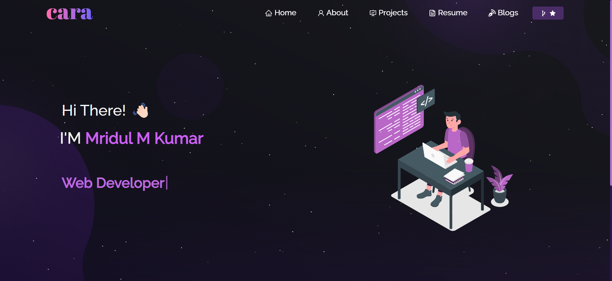

<h2 align="center">
  Portfolio Website - 
  
  
Welcome to my portfolio!

</h2>

  

## Table of Contents

- [Introduction](#introduction)
- [Technologies Used](#technologies-used)
- [Features](#features)

## Introduction

This portfolio showcases my projects, skills, and experiences. Feel free to explore the different sections and projects!

## Technologies Used

My personal portfolio <a href="https://mridul0703.vercel.app/" target="_blank">mridul.app</a> which features some of my github projects as well as my resume and technical skills. 

This project was built using these technologies.
 
- React.js
- Node.js
- Express.js
- CSS3
- VsCode
- Vercel

## Features

- Responsive design
- Project showcase
- Contact form

